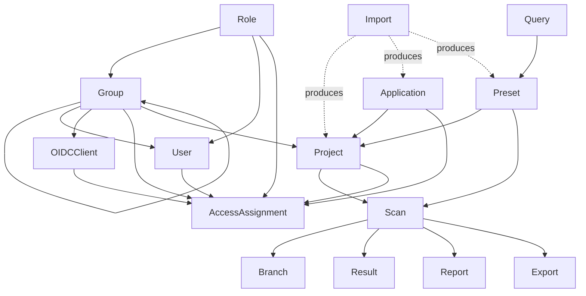

# CheckmarxOne Object Model

This document describes the shape of the CheckmarxOne (Cx1) platform's object
graph: what kinds of objects exist, what each depends on, and what order
things need to happen in. It is extracted from the platform's own end-to-end
test suite (its object-lifecycle test definitions), not from the Go client
code — the goal is to describe the platform, not any particular API binding.

There is no code in this document. If you're looking for how to call a
specific API, see the other files in `_examples/`.

## The object graph

At a high level, objects fall into three groups:

- **Identity & access** objects (Roles, Groups, Users, OIDC Clients, Access
  Assignments) — who can do what, and to which resources.
- **Organizational** objects (Applications, Projects) — containers that group
  work and that identity/access objects attach to.
- **Scanning & findings** objects (Presets, Queries, Scans, Branches,
  Results, Reports, Exports) — the actual security-testing pipeline that
  runs inside a Project.

A dashed arrow means "produces," not "references" — an Import is a bulk
shortcut that creates several other objects at once rather than referencing
ones that already exist.

Two object types have no dependencies and no dependents — they're pure,
independent leaves: **Feature Flags** (tenant-level toggles, read-only) and
**Analytics** (dashboard/KPI data, read-only). Neither needs anything else
to exist, and nothing depends on them.

## Object types

### Role
No dependencies — a Role is defined by a set of permissions and stands on
its own. Groups, Users, and Access Assignments reference Roles by name once
they exist.

### Group
Can optionally have a **parent Group**, forming a tree (e.g. a group can be
nested under another group, and can later be moved to a different parent).
Groups are referenced by Users (group membership), by OIDC Clients
(client-role bindings), and by Access Assignments (as the entity being
granted access). Both directions of the tree are meaningful in practice —
building it (creating a child under a known parent) and walking it
(listing a group's direct children, or its members) are equally common
operations; see `RECIPES.md`'s provisioning and access-resolution recipes,
which do exactly that.

### User
References existing **Groups** (membership) and **Roles** (direct role
assignment). Both must already exist before a User can be created with
those attachments.

### Application
A logical grouping of Projects. References **Projects** by name/ID, but the
relationship is optional in both directions — an Application can exist with
zero Projects, and a Project doesn't need an Application at all (it can
live directly under the tenant). The Project ↔ Application relationship can
be set from either side and is **eventually consistent** — reading it back
immediately after a write may require a retry before it reflects the
change.

### Project
The central organizational unit that scanning happens inside. References:
- **Groups** (which groups have access)
- **Applications** (optional — a Project can also live directly under the
  tenant with no Application at all)
- **Presets** (which preset — e.g. SAST — it scans with by default)

A Project must exist before any Scan, Result, Report, or Query override can
target it.

### Preset
A named collection of **Queries** (SAST and/or IAC) that a Scan runs with.
If a Preset references custom queries rather than built-in ones, those
queries must already exist before the Preset can include them. In
practice, a Preset is usually just referenced by name when configuring a
Scan or Project rather than fetched and inspected as its own object — the
full Preset object (list/create/clone/edit) is only needed if a script's
job is actually managing presets themselves, not just picking one.

### Query
A single detection rule, scoped at one of three levels: **Project**,
**Application**, or **Tenant** — forming an override hierarchy
(Project overrides beat Application overrides, which beat Tenant-wide
queries). Overriding an existing query at a broader scope requires the
underlying query to already exist.

Editing a Query through the current query-editor API (SAST or IAC) requires
an **audit session** to already be open — the session is the thing that's
actually being edited; the query change is committed through it. A session
can be reused across multiple edits as long as it's still valid for the
next one; otherwise a new session must be opened. Sessions aren't
auto-expired by the platform on your behalf, so a caller that opens sessions
and never closes them will accumulate leftover open sessions — closing a
session explicitly when it's no longer needed is the caller's
responsibility. The legacy SAST query API (the "old API" path) bypasses
this mechanism entirely and does not require a session.

### Scan
Requires a **Project** to run against, and optionally a specific **Preset**
(SAST and/or IAC) to override the project's default. A scan's source is
either a repository + branch, or an uploaded archive — and, as a third
option, a previously-exported SBOM can itself be uploaded as the source
for a scan (see Export below) instead of source code. Archive-based scans
have no inherent branch — if none is supplied, the platform records it as
`n/a`. Callers can supply any string they like instead; a common
convention (used by this test suite) is to record the literal value `zip`,
but it could equally be the actual branch that was checked out and archived
before scanning. A Scan is asynchronous: it must reach a terminal status
(completed, partial, or failed) before anything downstream (Results,
Reports) can be expected to reflect it.

A Scan can enable several engines at once, independent of which engine(s)
its Preset applies to: SAST, SCA, IaC (also called KICS), Containers, API
Security, and the Enterprise Secrets micro-engine (referred to internally
as "2ms") are all engines a Scan can be configured to run. Not every
engine is equally exposed for configuration/editing by this client — SAST
and IaC/KICS are the two with dedicated Query/Preset editing support — but
any of them can be turned on for a given Scan.

### Branch
Not an independently created object — it's an emergent property of a
Project having at least one Scan recorded against that branch name. A
Branch disappears once its last associated Scan is removed. Even though
nothing creates a Branch directly, a Project's current set of known
branches can still be discovered/listed directly rather than only
inferred by walking Scan history yourself.

### Result
A finding produced by a completed **Scan**, scoped to a **Project**. Each
finding has an engine type (SAST, IAC, or SCA) which determines the shape
of the filters used to query it (e.g. SAST results are filtered/identified
differently than SCA results). Requires a Project with at least one
completed Scan before any results can exist.

### Report
An export of scan or project data. A scan-level report covers exactly one
Project + Branch and requires that Project to have a completed Scan. A
project-level report can aggregate multiple Projects at once (no branch
needed) — but still requires each named Project to have completed scan
data available. A Project doesn't need an Application for either kind of
report to be requested.

### Export
A separate, SCA-specific sibling of Report: rather than a findings report,
an Export produces an SBOM (Software Bill of Materials) for a completed
**Scan**, in one of a few standard formats. It has its own
request/poll/download lifecycle, distinct from Report's. Unlike a Report,
an Export's output isn't just an artifact to keep — it can be fed back in
as the source for a brand new **Scan**, in place of a repository or an
uploaded archive.

### OIDC Client
A service-account-style identity, optionally bound to one or more
**Groups** for role inheritance. Used together with Access Assignments to
construct a restricted-permission identity distinct from the operator's own
credentials.

### Access Assignment
Grants a **Role** to an entity (**User**, **Group**, or **OIDC Client**)
over a resource (**Project**, **Application**, or the tenant itself, for a
tenant-wide grant). Both the entity and the resource must already exist —
an Access Assignment is pure glue between two other objects that were
created independently. Granting to an OIDC Client directly (rather than a
User or a Group) is the normal way to scope a service-account-style
identity down to only the access it actually needs.

### Import
A bulk-creation shortcut: given an archive from an external source plus a
name-mapping file, it produces a Project, an Application, and a Preset in
one step, as if they had been created manually. Anything created this way
can be referenced by later steps exactly as if it had gone through the
normal create path.

### Feature Flag
A tenant-level toggle, read-only from the object model's perspective. No
dependencies, no dependents — but several other object types' availability
or behavior (e.g. whether a legacy API path exists, or whether a permission
check applies) is gated by flag state.

### Analytics
Dashboard/KPI data, read-only. No dependencies, no dependents.

## Sequencing: what needs to exist before what

- **A Group** can be created standalone, but if it has a parent, that
  parent Group must exist (or be created in the same step) first.
- **A User** needs any Groups and Roles it's being assigned to already
  exist.
- **A Project** needs its target Groups, Applications, and (if non-default)
  Preset to already exist.
- **A Preset** needs any custom Queries it references to already exist.
- **A Query override** at Application or Project scope needs the
  underlying query (built-in or previously created on the Tenant level) 
  to exist. A Tenant query can override a Product query (or be entirely new), 
  an Application query overrides Tenant (or Product), and Project-level
  queries override Application-, Tenant-, or Product-level ones. 
- **Editing a Query** via the current query-editor API needs an open audit
  session first (reuse one if it's still valid, otherwise open a new one);
  the legacy SAST query API doesn't need a session at all but is unavailable
  except for specific customers.
- **A Scan** needs its Project and Preset to exist, and must reach a 
  terminal status before anything reads results from it.
- **A Result** needs a Project with at least one completed Scan.
- **A Report** needs the named Project(s) to have completed Scan data; a
  scan-level report additionally needs a specific Branch.
- **An Export (SBOM)** needs a completed SCA **Scan**; unlike a Report, its
  output can then become the source for starting a brand new Scan.
- **An Access Assignment** needs both its entity (OIDC Client/User/Group) 
  and its resource (Project/Application/Tenant) to exist.
- **An OIDC Client** used for integrations/service accounts needs its
  Groups (and any paired Access Assignments) to exist first.
- **An Import** short-circuits the above — it produces a Project,
  Application, and Preset together, so nothing needs to pre-exist except
  the archive and mapping file being imported.

### Teardown

For most object pairs, deletion order matters because one side can't exist
without the other (e.g. an Access Assignment can't outlive the User/Group
or Project/Application it points to). But the Project ↔ Application
relationship is a specific exception: since that link is optional in both
directions (a Project can live outside any Application, and an Application
can hold zero Projects), deleting an Application before or after the
Projects that reference it doesn't matter — neither side depends on the
other for its own existence.

Cleanup of anything created for a given purpose is expected to fully
reverse what was created for it, so that the same workflow can be repeated
without name collisions or leftover state. For Query edits specifically,
that includes closing any audit session that was opened and is no longer
needed — sessions left open are leftover state just like any other
uncleaned object.

